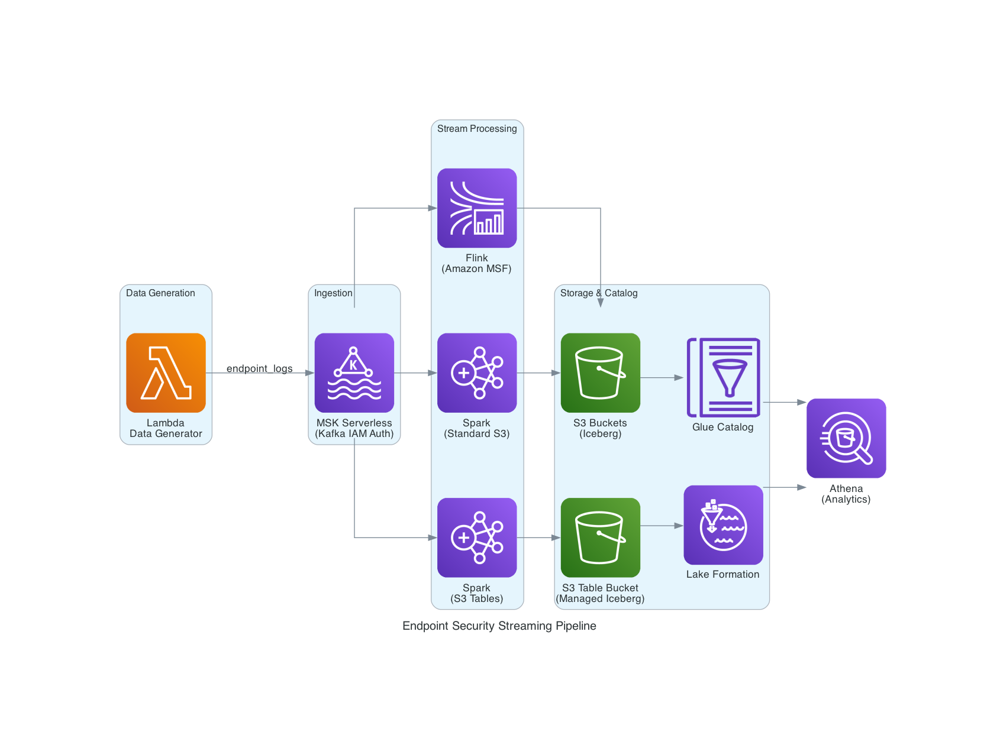

# Endpoint Security Streaming Pipeline

Real-world streaming data pipeline for processing endpoint security logs using AWS managed services. Supports three stream processing engines — all sharing a common MSK + Lambda ingestion layer.

## Architecture



```
Endpoint Devices → Lambda Data Generator → MSK Serverless (Kafka) → Stream Processor → Iceberg → Analytics
                                                                          │
                                                          ┌───────────────┼───────────────┐
                                                          │               │               │
                                                     Flink (MSF)    Spark (S3)    Spark (S3 Tables)
                                                          │               │               │
                                                     Glue Catalog    Glue Catalog    S3 Tables Catalog
```

## Directory Structure

```
endpoint-security-streaming-pipeline/
├── common/                        # Shared: MSK Serverless + Lambda data generator
│   ├── cdk/                       # CDK stacks (MSKStack, LambdaDataGenStack)
│   ├── lambda_function/           # Lambda code (data generator + MSK producer)
│   ├── scripts/                   # deploy_msk.sh, deploy_lambda.sh, generate_data.sh, cleanup_*.sh
│   ├── .env.msk                   # MSK outputs (auto-generated)
│   └── .env.lambda                # Lambda outputs (auto-generated)
│
├── flink-streaming/               # Flink on Amazon Managed Service for Apache Flink
│   ├── cdk/                       # CDK stack (two-phase: infra → MSF app)
│   ├── scripts/                   # build, deploy, start_app, update_app, cleanup, generate_data
│   ├── assembly/                  # Maven assembly descriptor (ZIP packaging)
│   ├── *.py                       # PyFlink application code
│   ├── pom.xml                    # Maven build (fat-jar + ZIP)
│   └── .env                       # Stack outputs (auto-generated)
│
├── spark-streaming-s3/            # Spark on EMR Serverless → Standard S3 (Iceberg)
│   ├── cdk/                       # CDK stack (EMR Serverless + S3 + Glue)
│   ├── scripts/                   # deploy, submit_job, submit_batch_test, cleanup, generate_data
│   └── .env                       # Stack outputs (auto-generated)
│
├── spark-streaming-s3tables/      # Spark on EMR Serverless → S3 Tables (Iceberg)
│   ├── cdk/                       # CDK stack (EMR Serverless + S3 Table Bucket)
│   ├── scripts/                   # deploy, submit_job, submit_batch_test, cleanup, generate_data
│   └── .env                       # Stack outputs (auto-generated)
│
├── deploy_flink.sh                # One-command deploy: MSK + Lambda + Flink
├── deploy_spark_s3.sh             # One-command deploy: MSK + Lambda + Spark (S3)
├── deploy_spark_s3tables.sh       # One-command deploy: MSK + Lambda + Spark (S3 Tables)
├── cleanup_flink.sh               # One-command teardown: Flink → Lambda → MSK
├── cleanup_spark_s3.sh            # One-command teardown: Spark S3 → Lambda → MSK
├── cleanup_spark_s3tables.sh      # One-command teardown: Spark S3 Tables → Lambda → MSK
├── status.sh                      # Dashboard: check all component statuses
└── CHANGELOG.md
```

## Quick Start

### Prerequisites

- AWS CLI configured with appropriate credentials
- Python 3.9+
- AWS CDK (`npm install -g aws-cdk` or via pnpm)
- Java JDK 11+ and Maven (for Flink only)
- VPC with at least 2 subnets in different AZs (required by MSK Serverless and all consumer stacks)

### Environment Setup

All components (MSK, Lambda, Flink, Spark) require VPC and subnet configuration. Set these before deploying:

```bash
export VPC_ID=vpc-xxxxxxxx
export SUBNET_IDS=subnet-aaa,subnet-bbb   # At least 2 subnets in different AZs
```

### One-Command Deploy

Each deploy script handles the full stack. If MSK and Lambda are already running, they are detected and skipped automatically.

```bash
cd endpoint-security-streaming-pipeline

# Option A: Flink on Amazon MSF
./deploy_flink.sh

# Option B: Spark on EMR Serverless → Standard S3
./deploy_spark_s3.sh

# Option C: Spark on EMR Serverless → S3 Tables
./deploy_spark_s3tables.sh
```

### Check Status

```bash
./status.sh
```

Displays a color-coded dashboard of all pipeline components in the current AWS region.

#### What It Checks

| Component | How It's Checked | Details Shown |
|---|---|---|
| MSK Stack | CloudFormation stack status (`MSKStack`) | Stack state |
| MSK Cluster | `kafka:DescribeClusterV2` using ARN from `.env.msk` | Cluster state, bootstrap servers |
| Lambda Stack | CloudFormation stack status (`LambdaDataGenStack`) | Stack state |
| Lambda Function | `lambda:GetFunction` using name from `.env.lambda` | Function state, name, Kafka topic |
| Flink Stack | CloudFormation stack status (`FlinkStreamingStack`) | Stack state |
| Flink MSF App | `kinesisanalyticsv2:DescribeApplication` using name from `flink-streaming/.env` | App status, database, warehouse bucket, log group |
| Spark S3 Stack | CloudFormation stack status (`SparkStreamingS3Stack`) | Stack state |
| Spark S3 EMR App | `emr-serverless:GetApplication` using ID from `spark-streaming-s3/.env` | App state, database, warehouse bucket |
| Spark S3 Tables Stack | CloudFormation stack status (`SparkStreamingStack`) | Stack state |
| Spark S3 Tables EMR App | `emr-serverless:GetApplication` using ID from `spark-streaming-s3tables/.env` | App state, namespace, table bucket |

#### Status Icons

| Icon | Meaning | States |
|---|---|---|
| 🟢 `●` | Healthy / deployed | ACTIVE, RUNNING, CREATE_COMPLETE, UPDATE_COMPLETE, READY, STARTED |
| 🟡 `◐` | In progress | CREATING, STARTING, UPDATING, *_IN_PROGRESS |
| ⚪ `○` | Not deployed | NOT_FOUND, NOT_DEPLOYED (`.env` file missing) |
| 🔴 `●` | Error / unexpected | Any other state |

#### Example Output

```
════════════════════════════════════════════════════════════
  Streaming Pipeline Status  (us-east-1)
════════════════════════════════════════════════════════════

▸ Common Infrastructure
  ●  MSK Stack:              CREATE_COMPLETE
  ●  MSK Cluster:            ACTIVE
     Bootstrap Servers:      boot-xxxxx.kafka-serverless.us-east-1.amazonaws.com:9098
  ●  Lambda Stack:           CREATE_COMPLETE
  ●  Lambda Function:        Active (streaming-demo-data-generator)
     Kafka Topic:            endpoint_logs

▸ Flink Streaming (Amazon MSF)
  ●  CDK Stack:              CREATE_COMPLETE
  ●  MSF Application:        RUNNING (flink-streaming-app)
     Database:               endpoint_security_flink
     Warehouse:              s3://flink-warehouse-bucket
     Log Group:              /aws/kinesis-analytics/flink-streaming

▸ Spark Streaming (Standard S3)
  ○  CDK Stack:              NOT_FOUND
  ○  .env:                   Not found (not deployed)

▸ Spark Streaming (S3 Tables)
  ○  CDK Stack:              NOT_FOUND
  ○  .env:                   Not found (not deployed)

════════════════════════════════════════════════════════════
```

The script reads environment files (`.env.msk`, `.env.lambda`, `flink-streaming/.env`, `spark-streaming-s3/.env`, `spark-streaming-s3tables/.env`) to discover resource identifiers, then queries AWS APIs for live status. Components that haven't been deployed yet show as `○ Not found`.

### Generate Test Data

```bash
# Single invocation (100 events)
./common/scripts/generate_data.sh

# Multiple invocations
./common/scripts/generate_data.sh 10

# Continuous for 1 hour
end=$(($(date +%s) + 3600)); while [ $(date +%s) -lt $end ]; do ./common/scripts/generate_data.sh 5; sleep 10; done
```

### One-Command Cleanup

Teardown order: consumer → Lambda → MSK.

```bash
./cleanup_flink.sh
./cleanup_spark_s3.sh
./cleanup_spark_s3tables.sh
```

## Database Names

Each consumer uses a unique Glue database/namespace to avoid conflicts when running simultaneously:

| Consumer | Database/Namespace |
|---|---|
| Flink (MSF) | `endpoint_security_flink` |
| Spark (Standard S3) | `endpoint_security_spark_s3` |
| Spark (S3 Tables) | `endpoint_security_spark_s3tables` |

## Stream Processing Comparison

| Feature | Flink (MSF) | Spark (Standard S3) | Spark (S3 Tables) |
|---|---|---|---|
| Processing Model | Event-by-event | Micro-batch | Micro-batch |
| Latency | Milliseconds | Seconds | Seconds |
| Deployment | Amazon MSF | EMR Serverless | EMR Serverless |
| Storage | Standard S3 | Standard S3 | S3 Table Bucket |
| Catalog | Glue Catalog | Glue Catalog | S3 Tables + Lake Formation |
| Lake Formation | Not needed | Not needed | Required |
| Windowing | Tumbling, Sliding, Cumulate | Micro-batch triggers | Micro-batch triggers |
| Aggregations | Built-in (6 tables) | Custom | Custom |
| Complexity | Medium (Maven build) | Lower | Higher (LF grants) |

## Component READMEs

- [common/README.md](common/README.md) — MSK Serverless + Lambda data generator
- [flink-streaming/README.md](flink-streaming/README.md) — Flink on Amazon MSF
- [spark-streaming-s3/README.md](spark-streaming-s3/README.md) — Spark → Standard S3
- [spark-streaming-s3tables/README.md](spark-streaming-s3tables/README.md) — Spark → S3 Tables

## Event Schema

Each generated event has 23 fields (20 base + 3 enrichment metadata). The schema is defined in `FakeDataGenerator` in `common/lambda_function/lambda_data_generator.py`.

| Field | Type | Description |
|---|---|---|
| event_id | string | Unique ID (e.g. `evt_1709500000_1`) |
| customer_id | string | Customer identifier (e.g. `cust_00001`) |
| tenant_id | string | Tenant identifier (e.g. `tenant_a`) |
| device_id | string | Device identifier (e.g. `device_4521`) |
| device_name | string | Device name (e.g. `LAPTOP-JOHN-042`) |
| device_type | string | laptop, desktop, server, tablet, mobile |
| event_type | string | 14 types: file_access, network_connection, malware_detection, etc. |
| event_category | string | Always `"security"` |
| severity | string | LOW, MEDIUM, HIGH, CRITICAL |
| timestamp | string | ISO 8601 format `yyyy-MM-ddTHH:mm:ssZ` |
| user | string | Email format (e.g. `john.doe@company.com`) |
| process_name | string | Process name (e.g. `chrome.exe`, `powershell.exe`) |
| file_path | string | File path (null for non-file events) |
| action | string | read, write, execute, delete, modify, connect, upload, download, install, encrypt |
| result | string | allowed, blocked, quarantined |
| ip_address | string | Random private IP |
| os | string | Windows 10/11, macOS, Ubuntu, iOS, Android |
| os_version | string | Version string matching the OS |
| threat_detected | boolean | Probability scales with severity |
| threat_type | string | 10 types when threat_detected=true, null otherwise |
| ingestion_timestamp | string | ISO timestamp (enrichment) |
| source | string | Always `"lambda_data_generator"` |
| version | string | Always `"1.0"` |
