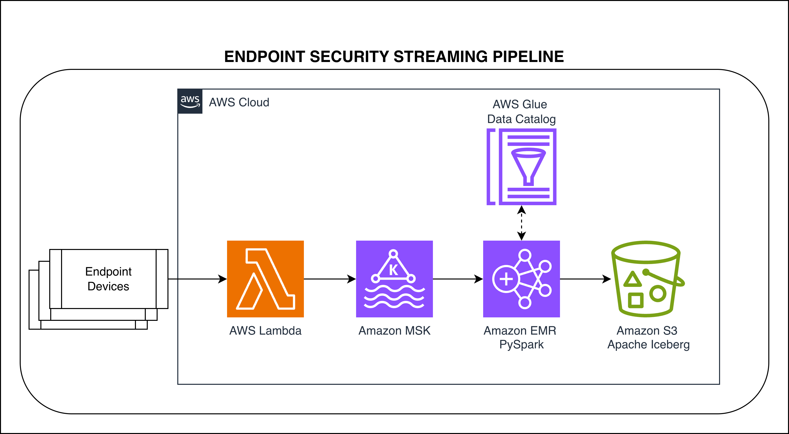

# Endpoint Security Streaming Pipeline

This repository demonstrates a real-world streaming data pipeline for processing endpoint security logs using AWS Lambda, Kafka, and multiple stream processing engines (Spark, Flink).

## ⚠️ Security Notice

**This is a demonstration/sample project for educational purposes.**

- **Kafka Authentication**: This code uses **unauthenticated/plaintext** connections to Kafka for simplicity
- **Production Use**: For production deployments, implement appropriate Kafka security:
  - **SASL/SCRAM** or **SASL/PLAIN** for authentication
  - **SSL/TLS** for encryption in transit
  - **ACLs** for topic-level authorization
  - **IAM authentication** for AWS MSK

**Example Production Kafka Configuration:**
```python
# Producer configuration with SASL/SCRAM
producer_config = {
    'bootstrap.servers': 'your-broker:9096',
    'security.protocol': 'SASL_SSL',
    'sasl.mechanism': 'SCRAM-SHA-512',
    'sasl.username': 'your-username',
    'sasl.password': 'your-password',
    'ssl.ca.location': '/path/to/ca-cert'
}
```

See [AWS MSK Security Documentation](https://docs.aws.amazon.com/msk/latest/developerguide/security.html) for detailed security configuration.

## Architecture Overview

The pipeline follows this flow:
```
Endpoint Devices → Lambda Producer → Kafka → Stream Processor → Iceberg (S3) → Analytics
                                                                      ↓
                                                                Glue Catalog
                                                                      ↓
                                                            Spark/Trino/Athena
```

## Repository Structure

```
endpoint-security-streaming-pipeline/
├── common/                          # Shared ingestion components
│   ├── lambda_producer.py           # Real event producer
│   ├── lambda_data_generator.py     # Fake event generator
│   ├── deploy_lambda.sh             # Deployment scripts
│   ├── deploy_data_generator.sh
│   ├── sample_events.json           # Sample data
│   └── README.md                    # Ingestion setup guide
│
├── spark-streaming/                 # Spark Structured Streaming
│   ├── spark_consumer.py            # PySpark consumer
│   └── README.md                    # Spark setup guide
│
├── flink-streaming/                 # Apache Flink (Coming Soon)
│   ├── flink_consumer.py            # Flink consumer (placeholder)
│   └── README.md                    # Flink setup guide
│
└── images/                          # Architecture diagrams
    └── endpoint-security-streaming-pipeline-architecture.png
```

## Stream Processing Options

This repository provides multiple stream processing implementations to suit different requirements:

### Spark Streaming (Available Now)



**Best for:**
- Production-grade batch + streaming workloads
- Python-first development
- Complex analytics and ML integration
- Existing Spark infrastructure

**Characteristics:**
- Micro-batch processing (seconds latency)
- Mature PySpark API
- Excellent for analytics workloads
- Easy integration with data science tools

**See:** [spark-streaming/README.md](spark-streaming/README.md)

### Flink Streaming (Coming Soon)

**Best for:**
- Ultra-low latency requirements (< 1 second)
- True event-by-event processing
- Complex event processing (CEP)
- Stateful stream processing

**Characteristics:**
- Event-by-event processing (milliseconds latency)
- Advanced state management
- Built-in CEP capabilities
- Native backpressure handling

**See:** [flink-streaming/README.md](flink-streaming/README.md)

## Quick Start

### Step 1: Setup Ingestion (Required for All)

The ingestion layer is shared across all stream processing engines.

```bash
cd common
```

Follow the setup guide in [common/README.md](common/README.md) to:
1. Create IAM roles for Lambda
2. Configure and deploy Lambda functions
3. Set up Kafka topic
4. Test event generation

### Step 2: Choose Stream Processing Engine

#### Option A: Spark Streaming (Recommended)

```bash
cd spark-streaming
```

Follow the setup guide in [spark-streaming/README.md](spark-streaming/README.md) to:
1. Configure Spark consumer
2. Deploy to EMR or run locally
3. Query data with Spark SQL

#### Option B: Flink Streaming (Coming Soon)

```bash
cd flink-streaming
```

See [flink-streaming/README.md](flink-streaming/README.md) for planned features and implementation timeline.

## Comparison

| Feature | Spark Streaming | Flink Streaming |
|---------|----------------|-----------------|
| **Status** | ✅ Available | 🚧 Coming Soon |
| **Latency** | Seconds (micro-batch) | Milliseconds (event-by-event) |
| **Processing Model** | Micro-batch | True streaming |
| **Deployment** | EMR, Databricks | Kinesis Analytics, EMR |
| **Language** | Python (PySpark) | Java, Python (PyFlink) |
| **State Management** | Checkpoints | Savepoints |
| **Maturity** | Very mature | Mature |
| **Ease of Use** | High (Python API) | Medium |
| **Analytics Integration** | Excellent | Good |
| **CEP Support** | Limited | Built-in |
| **ML Integration** | Excellent (MLlib) | Limited |

## Use Cases

### Production Use Case (Real Events)
- **Scenario:** Enterprise with 10,000+ endpoints
- **Setup:** Real endpoint agents → API Gateway → Lambda Producer → Kafka → Stream Processor → Iceberg
- **Volume:** 1M+ events per day
- **Purpose:** Real-time threat detection and compliance monitoring

### Testing Use Case (Generated Events)
- **Scenario:** Development and QA environments
- **Setup:** EventBridge Schedule → Lambda Data Generator → Kafka → Stream Processor → Iceberg
- **Volume:** Configurable (100-10,000 events per execution)
- **Purpose:** Pipeline testing, performance validation, demo environments

### Load Testing Use Case (Generated Events)
- **Scenario:** Validate pipeline can handle peak loads
- **Setup:** Multiple Lambda Data Generators → Kafka → Stream Processor → Iceberg
- **Volume:** 100K+ events per minute
- **Purpose:** Stress testing, capacity planning, optimization

## Event Schema

```json
{
  "customer_id": "cust_12345",
  "tenant_id": "tenant_abc",
  "device_id": "device_xyz",
  "device_name": "LAPTOP-001",
  "device_type": "laptop",
  "event_type": "file_access",
  "event_category": "security",
  "severity": "HIGH",
  "timestamp": "2024-01-16T10:30:00Z",
  "user": "john.doe@company.com",
  "process_name": "chrome.exe",
  "file_path": "/etc/passwd",
  "action": "read",
  "result": "blocked",
  "ip_address": "192.168.1.100",
  "os": "Windows 10",
  "os_version": "10.0.19045",
  "threat_detected": true,
  "threat_type": "unauthorized_access"
}
```

## Benefits

### Real-Time Processing
- Events processed within seconds (Spark) or milliseconds (Flink)
- Immediate threat detection and response
- Continuous monitoring of endpoint security

### Scalable Architecture
- Lambda scales automatically for event ingestion
- Kafka provides reliable message buffering
- Stream processors handle high-throughput workloads
- Iceberg optimizes storage and query performance

### Cost-Effective
- Pay-per-use Lambda pricing
- S3 storage with lifecycle policies
- Efficient Iceberg format reduces storage costs
- Partitioning minimizes query costs

### Analytics-Ready
- Data immediately available in Glue Catalog
- Query with Spark, Trino, or Athena
- Time-travel capabilities with Iceberg
- Optimized for time-range queries

### Flexible Processing
- Choose processing engine based on requirements
- Swap engines without changing ingestion
- Compare performance and costs
- Future-proof architecture

## Monitoring

### CloudWatch Metrics
- Lambda invocations and errors
- Kafka consumer lag
- Stream processor metrics
- S3 storage usage

### Logging
- Lambda logs in CloudWatch
- Stream processor logs
- Kafka broker logs

## Next Steps

1. **Complete Ingestion Setup**: Follow [common/README.md](common/README.md)
2. **Deploy Stream Processor**: Choose Spark or Flink
3. **Set Up Monitoring**: CloudWatch dashboards and alarms
4. **Implement Alerting**: High-severity threat alerts
5. **Optimize Performance**: Tune processing parameters
6. **Add Data Quality**: Validation and deduplication

## Contributing

Interested in contributing? We especially welcome:

- **Flink Implementation**: Help build the Flink streaming consumer
- **Performance Benchmarks**: Compare Spark vs Flink performance
- **Additional Processors**: Kafka Streams, Apache Beam, etc.
- **Documentation**: Improve setup guides and examples
- **Bug Fixes**: Report and fix issues

## References

- [Apache Iceberg Documentation](https://iceberg.apache.org/)
- [PySpark Structured Streaming](https://spark.apache.org/docs/latest/structured-streaming-programming-guide.html)
- [Apache Flink Documentation](https://flink.apache.org/docs/stable/)
- [AWS Glue Catalog](https://docs.aws.amazon.com/glue/latest/dg/catalog-and-crawler.html)
- [Apache Kafka](https://kafka.apache.org/documentation/)
- [AWS Lambda](https://docs.aws.amazon.com/lambda/)

## License

This project is provided as-is for educational and demonstration purposes.
