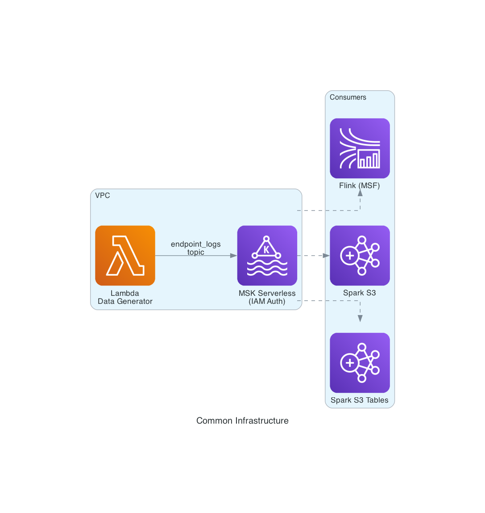

# Common Infrastructure — MSK Serverless + Lambda Data Generator

Shared ingestion layer used by all three stream processing consumers (Flink, Spark S3, Spark S3 Tables). Deploys an MSK Serverless cluster and a Lambda function that generates fake endpoint security events and publishes them to Kafka.

## Architecture



```
Lambda Data Generator → MSK Serverless (Kafka, IAM auth, port 9098) → Consumer (Flink / Spark)
```

## Directory Structure

```
common/
├── images/                          # Architecture diagrams
│   └── common_architecture.png
├── cdk/                             # CDK infrastructure code
│   ├── app.py                       # CDK app entry point (controls which stacks deploy)
│   ├── msk_stack.py                 # MSK Serverless cluster stack
│   ├── lambda_stack.py              # Lambda data generator stack
│   ├── cdk.json                     # CDK configuration
│   └── requirements.txt             # CDK Python dependencies
├── lambda_function/                 # Lambda function source code
│   ├── lambda_data_generator.py     # FakeDataGenerator + Kafka publisher (main)
│   └── msk_data_generator.py        # MSK-specific data generator variant
├── scripts/                         # Deployment and operational scripts
│   ├── deploy_msk.sh                # Deploy MSK Serverless cluster
│   ├── deploy_lambda.sh             # Deploy Lambda data generator
│   ├── generate_data.sh             # Invoke Lambda to generate events
│   ├── cleanup_msk.sh               # Destroy MSK stack
│   └── cleanup_lambda.sh            # Destroy Lambda stack
├── sample_events.json               # Example event payloads for reference
├── requirements.txt                 # Python dependencies
└── README.md
```

## Components

| Component | Stack Name | Description |
|---|---|---|
| MSK Serverless | `MSKStack` | Kafka cluster with IAM authentication, requires 2+ subnets in different AZs |
| Lambda Data Generator | `LambdaDataGenStack` | Generates fake endpoint security events, publishes to Kafka topic `endpoint_logs` |

## Scripts

All scripts are in `scripts/` and should be run from the `common/` directory or via the root-level combined deploy scripts.

| Script | Description |
|---|---|
| `scripts/deploy_msk.sh` | Deploy MSK Serverless cluster. Requires `VPC_ID` and `SUBNET_IDS` env vars. Outputs saved to `.env.msk` |
| `scripts/deploy_lambda.sh` | Deploy Lambda data generator. Reads MSK config from `.env.msk`. Outputs saved to `.env.lambda` |
| `scripts/generate_data.sh` | Invoke Lambda to generate events. Usage: `./scripts/generate_data.sh [count]` (default: 1 invocation) |
| `scripts/cleanup_msk.sh` | Destroy MSK stack and remove `.env.msk` |
| `scripts/cleanup_lambda.sh` | Destroy Lambda stack and remove `.env.lambda` |

## Prerequisites

- AWS CLI configured
- Python 3.9+
- AWS CDK
- Environment variables set:
  ```bash
  export VPC_ID=vpc-xxxxxxxx
  export SUBNET_IDS=subnet-aaa,subnet-bbb   # At least 2 subnets in different AZs
  ```

## Deploy

```bash
# Step 1: Deploy MSK
./scripts/deploy_msk.sh

# Step 2: Deploy Lambda (reads .env.msk)
./scripts/deploy_lambda.sh
```

Or use the root-level combined scripts which handle this automatically:
```bash
cd ..
./deploy_flink.sh      # Deploys MSK + Lambda + Flink
./deploy_spark_s3.sh   # Deploys MSK + Lambda + Spark (S3)
```

## Generate Data

```bash
# Single invocation (100 events)
./scripts/generate_data.sh

# 10 invocations
./scripts/generate_data.sh 10
```

## Event Schema

Each generated event has 23 fields (20 base + 3 enrichment metadata). The schema is defined in `FakeDataGenerator` class in `lambda_function/lambda_data_generator.py`.

| Field | Type | Description |
|---|---|---|
| event_id | string | Unique ID (e.g. `evt_1709500000_1`) |
| customer_id | string | Customer identifier (e.g. `cust_00001`) |
| tenant_id | string | Tenant identifier (e.g. `tenant_a`) |
| device_id | string | Device identifier (e.g. `device_4521`) |
| device_name | string | Device name (e.g. `LAPTOP-JOHN-042`) |
| device_type | string | laptop, desktop, server, tablet, mobile |
| event_type | string | 14 types: file_access, network_connection, malware_detection, etc. |
| event_category | string | Always `"security"` |
| severity | string | LOW, MEDIUM, HIGH, CRITICAL |
| timestamp | string | ISO 8601 format `yyyy-MM-ddTHH:mm:ssZ` |
| user | string | Email format (e.g. `john.doe@company.com`) |
| process_name | string | Process name (e.g. `chrome.exe`, `powershell.exe`) |
| file_path | string | File path (null for non-file events) |
| action | string | read, write, execute, delete, modify, connect, upload, download, install, encrypt |
| result | string | allowed, blocked, quarantined |
| ip_address | string | Random private IP |
| os | string | Windows 10/11, macOS, Ubuntu, iOS, Android |
| os_version | string | Version string matching the OS |
| threat_detected | boolean | Probability scales with severity |
| threat_type | string | 10 types when threat_detected=true, null otherwise |
| ingestion_timestamp | string | ISO timestamp (enrichment) |
| source | string | Always `"lambda_data_generator"` |
| version | string | Always `"1.0"` |

## Environment Files

| File | Created By | Contents |
|---|---|---|
| `.env.msk` | `deploy_msk.sh` | `MSK_CLUSTER_ARN`, `MSK_SECURITY_GROUP_ID`, `KAFKA_BOOTSTRAP_SERVERS`, `VPC_ID`, `SUBNET_IDS` |
| `.env.lambda` | `deploy_lambda.sh` | `LAMBDA_FUNCTION`, `KAFKA_TOPIC` |

These files are read by all consumer deploy scripts to connect to the shared MSK cluster.

## Cleanup

```bash
# Cleanup Lambda first, then MSK
./scripts/cleanup_lambda.sh
./scripts/cleanup_msk.sh
```

## CDK Stacks

The CDK app in `cdk/` contains two stacks controlled by context flags:
- `deploy_msk=true` → deploys `MSKStack`
- `deploy_lambda=true` → deploys `LambdaDataGenStack`
