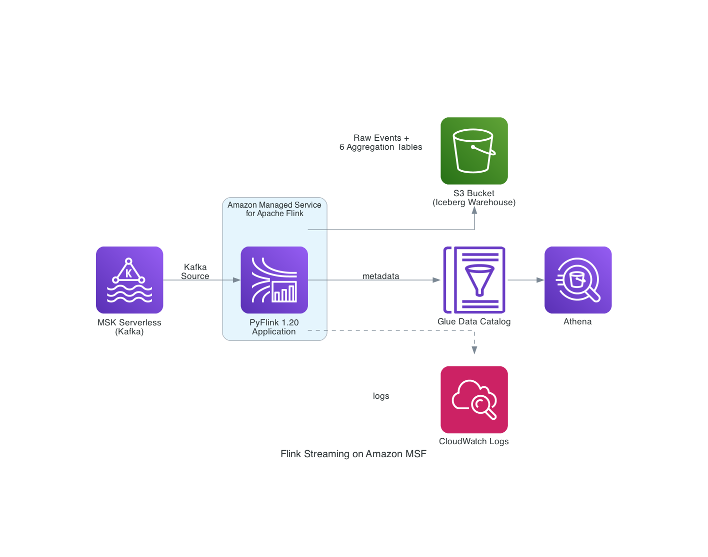

# Flink Streaming — Amazon Managed Service for Apache Flink

PyFlink streaming application that consumes endpoint security events from MSK Serverless (Kafka) and writes to Apache Iceberg tables on S3 via AWS Glue Catalog. Deployed on Amazon Managed Service for Apache Flink (MSF).

## Architecture



```
MSK Serverless (Kafka) → PyFlink on Amazon MSF → Iceberg Tables (S3) → Glue Catalog → Athena/Spark
```

## Directory Structure

```
flink-streaming/
├── images/                              # Architecture diagrams
│   └── flink_architecture.png
├── cdk/                                 # CDK infrastructure code
│   ├── app.py                           # CDK app entry point
│   ├── stack.py                         # FlinkStreamingStack (S3 buckets, IAM, SG, MSF app)
│   ├── cdk.json                         # CDK configuration
│   └── requirements.txt                 # CDK Python dependencies
├── scripts/                             # Deployment and operational scripts
│   ├── deploy.sh                        # Full deploy: Phase 1 CDK → Maven build → S3 upload → Phase 2 CDK
│   ├── build.sh                         # Maven build only (fat-jar + assembly ZIP)
│   ├── start_app.sh                     # Start MSF application (auto-retries with --skip-restore)
│   ├── update_app.sh                    # Rebuild → upload → stop → update code reference
│   ├── generate_data.sh                 # Convenience wrapper for common/scripts/generate_data.sh
│   └── cleanup.sh                       # Stop MSF app, drop Glue DB, destroy CDK stack
├── assembly/                            # Maven assembly descriptor
│   └── assembly.xml                     # ZIP packaging: Python files + lib/pyflink-dependencies.jar
├── src/main/                            # Maven source tree (empty — used for build structure)
├── flink_consumer_with_aggregations.py  # Main entry point: loads config, sets up pipeline
├── aggregation_config.py                # Configuration dataclass for Kafka, Iceberg, windows
├── table_creators.py                    # DDL: Kafka source, Iceberg catalog/database/tables
├── aggregation_jobs.py                  # TVF window queries (tumbling, sliding, cumulate)
├── pom.xml                              # Maven build: Kafka connector, Iceberg, MSK IAM auth
├── application_properties.json          # Local dev config (MSF generates its own at runtime)
└── README.md
```

## What Gets Created

| Resource | Description |
|---|---|
| S3 Artifact Bucket | Stores the Flink application ZIP |
| S3 Warehouse Bucket | Iceberg table data (parquet files) |
| IAM Role | MSF execution role with S3, Glue, MSK, VPC, CloudWatch permissions |
| Security Group | Flink ENIs for VPC connectivity to MSK |
| CloudWatch Log Group | Application logs |
| MSF Application | PyFlink 1.20 application with Kafka source and Iceberg sink |

## Tables

The application creates 7 Iceberg tables in the `endpoint_security_flink` Glue database:

| Table | Type | Description |
|---|---|---|
| `endpoint_data_flink` | Raw events | All events with event_time, partitioned by year/month/day |
| `threat_summary_tumbling_5min` | Tumbling window | 5-minute fixed windows |
| `threat_summary_tumbling_15min` | Tumbling window | 15-minute fixed windows |
| `threat_summary_tumbling_30min` | Tumbling window | 30-minute fixed windows |
| `threat_summary_tumbling_60min` | Tumbling window | 60-minute fixed windows |
| `threat_summary_sliding_5min` | Sliding window | 5-minute window, 1-minute slide |
| `threat_sessions_5min_gap` | Cumulate window | 5-minute step, 60-minute max |

Aggregation tables use PROCTIME() for windowing (event time watermarks don't advance reliably on MSF).

## Prerequisites

- AWS CLI configured
- Python 3.9+
- AWS CDK
- Java JDK 11+
- Apache Maven 3.6+
- MSK and Lambda deployed (via `common/scripts/` or root-level `deploy_flink.sh`)
- Environment variables set:
  ```bash
  export VPC_ID=vpc-xxxxxxxx
  export SUBNET_IDS=subnet-aaa,subnet-bbb   # At least 2 subnets in different AZs
  ```

## Scripts

All scripts are in `scripts/` and should be run from the `flink-streaming/` directory.

| Script | Description |
|---|---|
| `scripts/deploy.sh` | Full deployment: Phase 1 (infra CDK) → Maven build → S3 upload → Phase 2 (MSF app CDK). Saves outputs to `.env` |
| `scripts/build.sh` | Maven build only: creates fat-jar + assembly ZIP (`flink-application.zip`) |
| `scripts/start_app.sh` | Start the MSF application. Auto-retries with `--skip-restore` if savepoint is incompatible |
| `scripts/update_app.sh` | Rebuild → upload ZIP → stop app → update code reference. For code changes without redeploying infra |
| `scripts/generate_data.sh` | Convenience wrapper that calls `common/scripts/generate_data.sh` |
| `scripts/cleanup.sh` | Stop MSF app → drop Glue database/tables → destroy CDK stack → clean build artifacts |

## Quick Start

### Option A: Full stack deploy (recommended)

From the `endpoint-security-streaming-pipeline/` root:
```bash
./deploy_flink.sh
```
This deploys MSK + Lambda + Flink in one command, skipping MSK/Lambda if already running.

### Option B: Flink only (MSK + Lambda already deployed)

```bash
cd flink-streaming
./scripts/deploy.sh
```

### Start the application

```bash
./scripts/start_app.sh
```

### Generate test data

```bash
./scripts/generate_data.sh 10    # 10 Lambda invocations
```

### Update code (no infra changes)

```bash
./scripts/update_app.sh
./scripts/start_app.sh
```

## Two-Phase CDK Deployment

The CDK stack uses a two-phase approach because the MSF application needs the ZIP to exist in S3 before it can be created:

1. **Phase 1** (`cdk deploy` without `-c deploy_app=true`): Creates S3 buckets, IAM role, security group, log group
2. **Build & Upload**: Maven builds the fat-jar + ZIP, uploads to S3
3. **Phase 2** (`cdk deploy -c deploy_app=true`): Creates the MSF application pointing to the uploaded ZIP

## Application Code

| File | Description |
|---|---|
| `flink_consumer_with_aggregations.py` | Main entry point — loads config, sets up pipeline, executes all queries |
| `aggregation_config.py` | Configuration dataclass for Kafka, Iceberg, and window parameters |
| `table_creators.py` | DDL for Kafka source table, Iceberg catalog/database/tables |
| `aggregation_jobs.py` | TVF window queries (tumbling, sliding, cumulate) |
| `application_properties.json` | Local development config (MSF generates its own at runtime) |
| `pom.xml` | Maven build: Kafka connector, Iceberg runtime, MSK IAM auth, S3 filesystem |
| `assembly/assembly.xml` | ZIP packaging: Python files + lib/pyflink-dependencies.jar |

## Configuration

Runtime configuration is managed via MSF application properties (set in CDK stack). Key properties in the `consumer.config.0` group:

| Property | Default | Description |
|---|---|---|
| `kafka.bootstrap.servers` | (from MSK) | MSK bootstrap servers |
| `kafka.topic.name` | `endpoint_logs` | Kafka topic |
| `database.name` | `endpoint_security_flink` | Glue database name |
| `enable.raw.events` | `true` | Write raw events to Iceberg |
| `enable.tumbling.windows` | `true` | Enable tumbling window aggregations |
| `enable.sliding.windows` | `true` | Enable sliding window aggregation |
| `enable.session.windows` | `true` | Enable cumulate window aggregation |
| `tumbling.window.minutes` | `5,15,30,60` | Tumbling window durations |

## Environment File

After deployment, `.env` contains:
```
ARTIFACT_BUCKET=...
WAREHOUSE_BUCKET=...
APP_NAME=...
DATABASE=endpoint_security_flink
LOG_GROUP=...
KAFKA_BOOTSTRAP_SERVERS=...
```

## Monitoring

```bash
# Tail application logs
aws logs tail $LOG_GROUP --follow --region us-east-1

# Check application status
aws kinesisanalyticsv2 describe-application --application-name $APP_NAME --region us-east-1
```

Or use the root-level status script:
```bash
cd ..
./status.sh
```

## Key Technical Decisions

- **PROCTIME() for windowing**: Event time watermarks don't advance on this MSF setup, so all windowed aggregations use processing time
- **TVF window syntax**: Flink 1.20 deprecated legacy GROUP BY window functions; uses `TABLE(TUMBLE(...))`, `TABLE(HOP(...))`, `TABLE(CUMULATE(...))`
- **Append mode for aggregation tables**: TVF windows emit append-only rows, incompatible with upsert mode
- **CUMULATE replaces SESSION**: Flink 1.20 doesn't support SESSION TVF
- **Non-shaded Kafka connector**: `flink-sql-connector-kafka` (shaded) conflicts with `aws-msk-iam-auth`; uses `flink-connector-kafka` + `kafka-clients` instead
- **Snapshots disabled**: Avoids savepoint restore failures after code changes

## Cleanup

```bash
# Flink only
./scripts/cleanup.sh

# Full stack (Flink + Lambda + MSK)
cd ..
./cleanup_flink.sh
```
