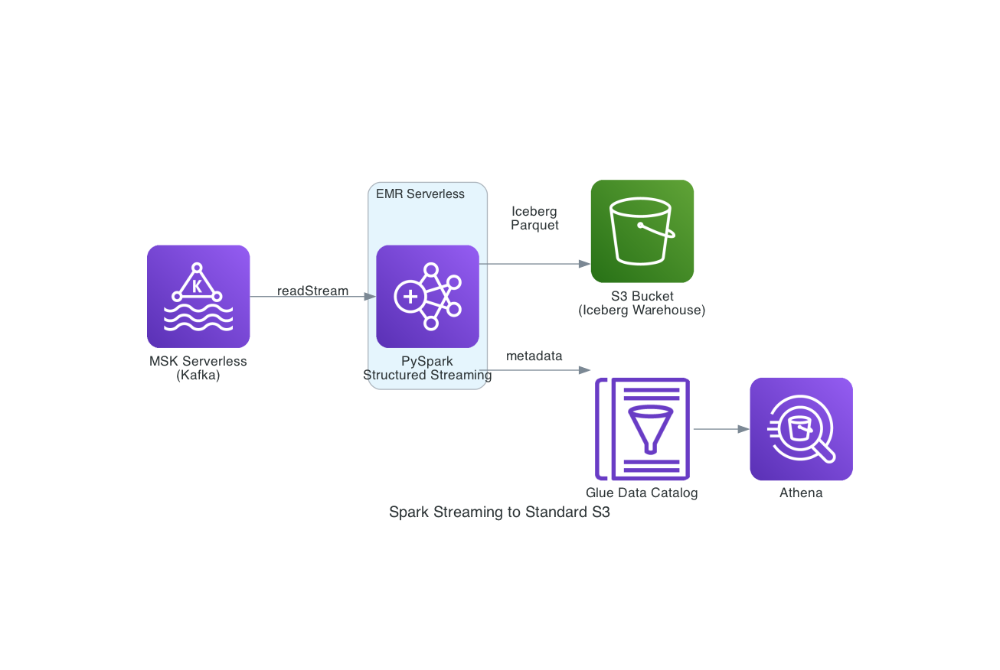

# Spark Streaming — EMR Serverless → Standard S3 (Iceberg)

PySpark Structured Streaming job that reads endpoint security events from MSK Serverless (Kafka) and writes to Apache Iceberg tables on standard S3. Deployed on Amazon EMR Serverless. Uses AWS Glue Catalog for metadata.

## Architecture



```
MSK Serverless (Kafka) → PySpark on EMR Serverless → Iceberg Tables (Standard S3) → Glue Catalog → Athena
```

## Directory Structure

```
spark-streaming-s3/
├── images/                          # Architecture diagrams
│   └── spark_s3_architecture.png
├── cdk/                             # CDK infrastructure code
│   ├── app.py                       # CDK app entry point
│   ├── stack.py                     # SparkStreamingS3Stack (S3 bucket, EMR app, IAM role, SG)
│   ├── cdk.json                     # CDK configuration
│   └── requirements.txt             # CDK Python dependencies
├── pyspark/                         # PySpark application code
│   ├── spark_consumer.py            # Streaming consumer: Kafka → Iceberg on S3
│   └── batch_test.py                # Batch connectivity test (creates test table, writes sample data)
├── scripts/                         # Deployment and operational scripts
│   ├── deploy.sh                    # Deploy CDK stack, save outputs to .env
│   ├── submit_job.sh                # Submit streaming job to EMR Serverless
│   ├── submit_batch_test.sh         # Submit batch test job
│   ├── generate_data.sh             # Convenience wrapper for common/scripts/generate_data.sh
│   └── cleanup.sh                   # Stop EMR app, drop Glue DB, destroy CDK stack
└── README.md
```

## What Gets Created

| Resource | Description |
|---|---|
| S3 Warehouse Bucket | Standard S3 bucket for Iceberg data (parquet files) |
| Glue Database | `endpoint_security_spark_s3` in AWS Glue Data Catalog |
| EMR Serverless Application | Spark 3.5 runtime for streaming/batch jobs |
| IAM Role | EMR execution role with S3, Glue, MSK, CloudWatch permissions |
| Security Group | EMR ENIs for VPC connectivity to MSK |

## Prerequisites

- AWS CLI configured
- Python 3.9+
- AWS CDK
- MSK and Lambda deployed (via `common/scripts/` or root-level `deploy_spark_s3.sh`)
- Environment variables set:
  ```bash
  export VPC_ID=vpc-xxxxxxxx
  export SUBNET_IDS=subnet-aaa,subnet-bbb   # At least 2 subnets in different AZs
  ```

## Scripts

All scripts are in `scripts/` and should be run from the `spark-streaming-s3/` directory.

| Script | Description |
|---|---|
| `scripts/deploy.sh` | Deploy CDK stack. Saves outputs to `.env` |
| `scripts/submit_job.sh` | Submit streaming job to EMR Serverless |
| `scripts/submit_batch_test.sh` | Submit a batch test job to verify connectivity |
| `scripts/generate_data.sh` | Convenience wrapper that calls `common/scripts/generate_data.sh` |
| `scripts/cleanup.sh` | Stop EMR app → drop Glue database/tables → destroy CDK stack |

## Quick Start

### Option A: Full stack deploy (recommended)

From the `endpoint-security-streaming-pipeline/` root:
```bash
./deploy_spark_s3.sh
```
This deploys MSK + Lambda + Spark (S3) in one command, skipping MSK/Lambda if already running.

### Option B: Spark only (MSK + Lambda already deployed)

```bash
cd spark-streaming-s3
./scripts/deploy.sh
```

### Submit streaming job

```bash
./scripts/submit_job.sh
```

### Generate test data

```bash
./scripts/generate_data.sh 10
```

## Application Code

| File | Description |
|---|---|
| `pyspark/spark_consumer.py` | Main streaming consumer — reads from Kafka, parses JSON, writes to Iceberg on S3 |
| `pyspark/batch_test.py` | Batch connectivity test — creates a test table, writes 5 sample rows, verifies read-back |
| `cdk/stack.py` | CDK stack: S3 warehouse bucket, EMR Serverless app (Spark 3.5, emr-7.12.0), IAM role, security group |
| `cdk/app.py` | CDK app entry point |

### Streaming Consumer Details

`spark_consumer.py` uses PySpark Structured Streaming with:
- Kafka source with IAM authentication (MSK Serverless, port 9098)
- JSON parsing of the 23-field endpoint security event schema
- Kafka metadata enrichment (kafka_timestamp, kafka_partition, kafka_offset)
- Time-based partitioning (event_year, event_month, event_day)
- 30-second micro-batch trigger
- Iceberg append mode with fanout enabled

## Database

- Database: `endpoint_security_spark_s3` (Glue Catalog)
- Warehouse: `s3://<warehouse-bucket>/iceberg/`
- No Lake Formation grants needed — standard Glue Catalog + S3

## Environment File

After deployment, `.env` contains:
```
WAREHOUSE_BUCKET=...
WAREHOUSE_LOCATION=s3://...
DATABASE=endpoint_security_spark_s3
EMR_APP_ID=...
EMR_ROLE_ARN=...
KAFKA_BOOTSTRAP_SERVERS=...
```

## Comparison with S3 Tables Variant

| Feature | Standard S3 (this) | S3 Tables |
|---|---|---|
| Storage | Standard S3 bucket | S3 Table Bucket (managed) |
| Catalog | Glue Catalog | S3 Tables + Lake Formation |
| Lake Formation | Not needed | Required |
| Setup Complexity | Lower | Higher |
| Auto-compaction | Manual | Automatic |

## Monitoring

```bash
# Check EMR job status
aws emr-serverless list-job-runs --application-id $EMR_APP_ID --region us-east-1

# Or use the root-level status script
cd ..
./status.sh
```

## Cleanup

```bash
# Spark S3 only
./scripts/cleanup.sh

# Full stack (Spark + Lambda + MSK)
cd ..
./cleanup_spark_s3.sh
```
