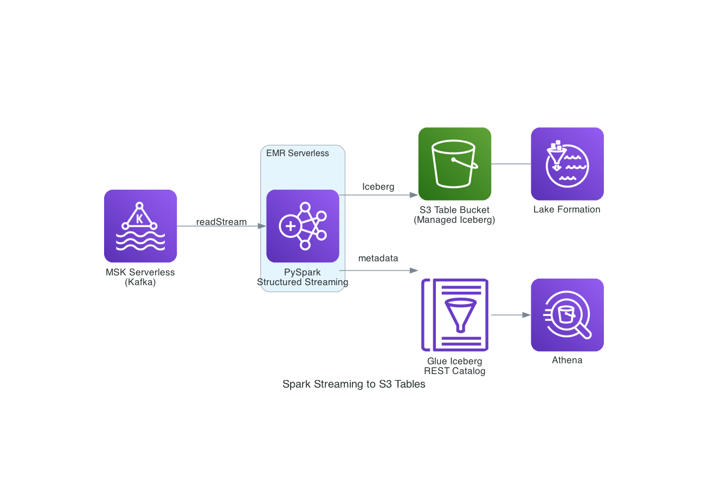

# Spark Streaming — EMR Serverless → S3 Tables (Iceberg)

PySpark Structured Streaming job that reads endpoint security events from MSK Serverless (Kafka) and writes to Apache Iceberg tables on S3 Tables. Deployed on Amazon EMR Serverless.

## Architecture



```
MSK Serverless (Kafka) → PySpark on EMR Serverless → Iceberg Tables (S3 Table Bucket) → Lake Formation → Athena
```

## Directory Structure

```
spark-streaming-s3tables/
├── images/                          # Architecture diagrams
│   └── spark_s3tables_architecture.png
├── cdk/                             # CDK infrastructure code
│   ├── app.py                       # CDK app entry point
│   ├── stack.py                     # SparkStreamingStack (S3 Table Bucket, EMR app, IAM role, SG, LF)
│   ├── cdk.json                     # CDK configuration
│   └── requirements.txt             # CDK Python dependencies
├── pyspark/                         # PySpark application code
│   ├── spark_consumer.py            # Streaming consumer: Kafka → Iceberg on S3 Tables
│   └── batch_test.py                # Batch connectivity test (REST + GlueCatalog modes)
├── scripts/                         # Deployment and operational scripts
│   ├── deploy.sh                    # Deploy CDK stack + grant LF permissions, save outputs to .env
│   ├── submit_job.sh                # Submit streaming job to EMR Serverless
│   ├── submit_batch_test.sh         # Submit batch test job
│   ├── generate_data.sh             # Convenience wrapper for common/scripts/generate_data.sh
│   └── cleanup.sh                   # Revoke LF, stop EMR, delete S3 Tables, destroy CDK stack
└── README.md
```

## What Gets Created

| Resource | Description |
|---|---|
| S3 Table Bucket | Managed Iceberg storage with automatic compaction |
| EMR Serverless Application | Spark 3.5 runtime for streaming/batch jobs |
| IAM Role | EMR execution role with S3 Tables, MSK, Glue, CloudWatch permissions |
| Security Group | EMR ENIs for VPC connectivity to MSK |
| Lake Formation Grants | Catalog-level permissions on S3 Tables nested catalog (granted via AWS CLI) |

## Prerequisites

- AWS CLI configured
- Python 3.9+
- AWS CDK
- MSK and Lambda deployed (via `common/scripts/` or root-level `deploy_spark_s3tables.sh`)
- Environment variables set:
  ```bash
  export VPC_ID=vpc-xxxxxxxx
  export SUBNET_IDS=subnet-aaa,subnet-bbb   # At least 2 subnets in different AZs
  ```

## Scripts

All scripts are in `scripts/` and should be run from the `spark-streaming-s3tables/` directory.

| Script | Description |
|---|---|
| `scripts/deploy.sh` | Deploy CDK stack + grant Lake Formation permissions. Saves outputs to `.env` |
| `scripts/submit_job.sh` | Submit streaming job to EMR Serverless |
| `scripts/submit_batch_test.sh` | Submit a batch test job to verify connectivity |
| `scripts/generate_data.sh` | Convenience wrapper that calls `common/scripts/generate_data.sh` |
| `scripts/cleanup.sh` | Revoke LF permissions → stop EMR app → delete S3 Tables → destroy CDK stack |

## Quick Start

### Option A: Full stack deploy (recommended)

From the `endpoint-security-streaming-pipeline/` root:
```bash
./deploy_spark_s3tables.sh
```
This deploys MSK + Lambda + Spark (S3 Tables) in one command, skipping MSK/Lambda if already running.

### Option B: Spark only (MSK + Lambda already deployed)

```bash
cd spark-streaming-s3tables
./scripts/deploy.sh
```

### Submit streaming job

```bash
./scripts/submit_job.sh
```

### Generate test data

```bash
./scripts/generate_data.sh 10
```

## Database

- Namespace/Database: `endpoint_security_spark_s3tables`
- Catalog: S3 Tables nested catalog (requires Lake Formation grants)

## Environment File

After deployment, `.env` contains:
```
BUCKET_NAME=...
BUCKET_ARN=...
NAMESPACE=endpoint_security_spark_s3tables
EMR_APP_ID=...
EMR_ROLE_ARN=...
S3_TABLES_CATALOG_ID=...
KAFKA_BOOTSTRAP_SERVERS=...
```

## Application Code

| File | Description |
|---|---|
| `pyspark/spark_consumer.py` | Main streaming consumer — reads from Kafka, parses JSON, writes to Iceberg on S3 Tables |
| `pyspark/batch_test.py` | Batch connectivity test — supports REST and GlueCatalog modes, creates test table, writes 5 rows |
| `cdk/stack.py` | CDK stack: S3 Table Bucket with resource policy, EMR Serverless app (emr-7.12.0), IAM role, SG, LF permissions |
| `cdk/app.py` | CDK app entry point |

### Streaming Consumer Details

`spark_consumer.py` uses PySpark Structured Streaming with:
- Kafka source with IAM authentication (MSK Serverless, port 9098)
- JSON parsing of the 23-field endpoint security event schema
- Kafka metadata enrichment (kafka_timestamp, kafka_partition, kafka_offset)
- Time-based partitioning (event_year, event_month, event_day)
- 30-second micro-batch trigger
- Iceberg append mode with fanout enabled

## Key Technical Notes

- CloudFormation/CDK cannot grant Lake Formation permissions on S3 Tables nested catalogs — the deploy script uses AWS CLI
- EMR Serverless does not support all availability zones (e.g., us-east-1e)

## Monitoring

```bash
# Check EMR job status
aws emr-serverless list-job-runs --application-id $EMR_APP_ID --region us-east-1

# Or use the root-level status script
cd ..
./status.sh
```

## Cleanup

```bash
# Spark S3 Tables only
./scripts/cleanup.sh

# Full stack (Spark + Lambda + MSK)
cd ..
./cleanup_spark_s3tables.sh
```
